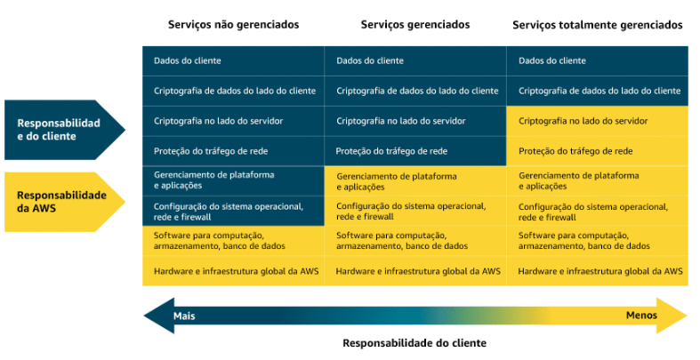

<h2>Módulo 3 - Serviços Computacionais</h2>

A AWS oferece 3 subdivisões para seus serviços em nuvem, sendo: (1) Não Gerenciado; (2) Gerenciado; (3) Totalmente Gerenciado (Serverless). Serviços como o EC2 são classificados como não gerenciados, o que significa que o cliente tem mais responsabilidades na configuração e gerenciamento do serviço, o que pode ser mais customizável, mais também muito mais trabalhoso e complexo. Por outro lado, o serviço AWS Lambda é uma opção sem servidor (Serverless) que elimina a necessidade do cliente de provisionar e gerenciar qualquer servidor, focando apenas no desenvolvimento, implementação e proteção do código.

</img>

 Fonte: Amazon Web Services (2025).

O serviço Lambda é um serviço computacional serverless que executa um código a partir de determinado evento, como outro serviço da AWS, aplicativos móveis ou solicitações HTTP. O código inserido é tratado como uma função que só é acionada a partir desse evento. A cobrança é feita pelo tempo computacional usado.

<h3>Contêineres</h3>

Os contêineres são soluções que agrupam uma aplicação com todas as suas dependências e configurações, para que ela seja executada da mesma forma em direfentes ambientes. Ou seja, é uma solução que empacota tudo que é preciso para rodar uma aplicação para que ela funcione da mesma forma em diferentes máquinas

A AWS tem algumas soluções voltadas para o gerenciamento de contêineres, como:

- Amazon ECS (Elastic Container Service): serviço escalável que executa e gerencia containers na AWS, como containers Docker. 
- Amazon EKS (Elastic Kubernetes Service): serviço totalmente gerenciado para executar o Kubernetes na AWS, simplificando a implantação, gerenciamento e escalonamento de aplicações. 
- Amazon ECR (Elastic Container Registry): serviço onde é possível armazenar, gerenciar e implantar imagens de containers. É possivel realizar operações sobre ela com ferramentas padrão de containers e também por meio de CLIs.
- AWS Fargate: serviço Serverless para containers que funciona com as soluções ECS e EKS. O Fargate é uma plataforma de hospedagem de containers, ao invés das outras soluções, que são de orquestração. Como é serverless, o foco está em inovar e desenvolver as aplicações e não em gerenciar o servidor. 

Dessa forma, o processo completo da implementação de um container na AWS é:

1. Começar fazendo upload de uma imagem de container para o Amazon ECR
2. Escolher uma solução de orquestração com base nas necessidades: ECS ou EKS
3. Escolher em qual plataforma rodar o container: EC2(Mais personalizável) ou Fargate(Serverless)
