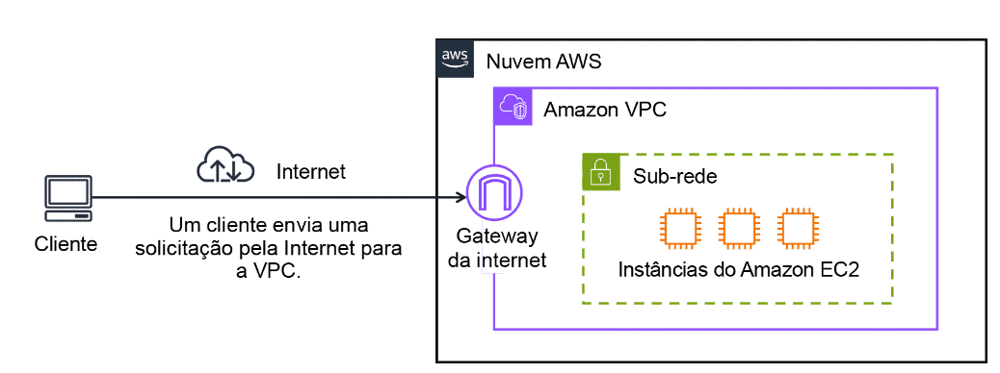
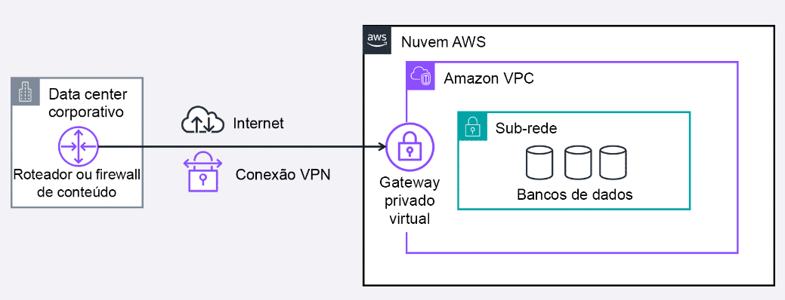
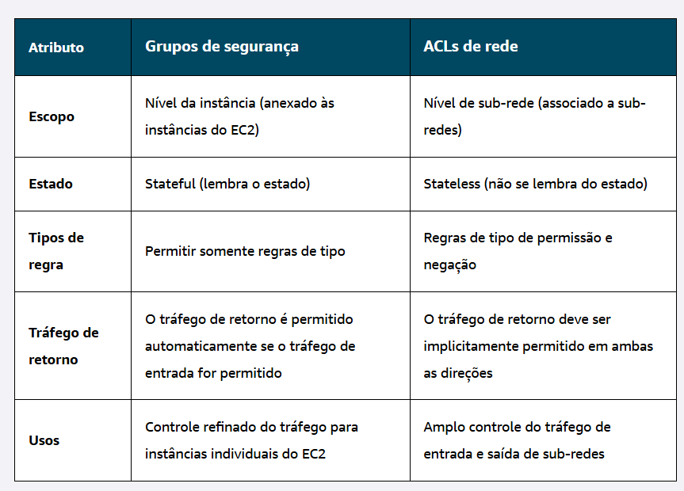

<h2>Módulo 5 - Redes</h2>

O termo rede se refere aos dispositivos interconectados que podem trocar dados e recursos. A Amazon disponibiliza um serviço chamado VPC ou Virtual Private Cloud, que permite provisionar uma seção logicamente separada na nuvem AWS. Ela possui sub-redes que são classificadas entre privadas e públicas, e que nada mais são que segmentos lógicos dentro da rede, o que permite maior controle e gerenciamento. De forma técnica, uma sub-rede é um intervalo de enderoços IP na VPC. As sub-redes privadas não possuem acesso direto à internet, e normalmente contém recursos como um banco de dados. Já as públicas possuem acesso direto à internet 

</img>

 Fonte: Amazon Web Services (2025).

Para permitir que o tráfego público da internet acesse a VPC, é preciso de um gateway de internet que esteja ligado à VPC, e que funciona como uma porta de entrada para que os clientes acessem a aplicação. No entanto, caso a VPC possua apenas recursos privados, é preciso de outro gateway, um Gateway Privado Virtual, onde é possível estabelecer uma conexão com uma Rede Virtual Privada (VPN) e assegurar que somente o tráfego proveniente de uma rede aprovada seja endereçado para a VPC, como mostra o diagrama a seguir:

</img>

 Fonte: Amazon Web Services (2025).

<h2>Conexão com a Nuvem</h2>

Há ainda outras formas de se conectar com a nuvem AWS, a depender das necessidades específicas de cada caso:

- AWS Direct Connect: conexão privada e dedicada da AWS com o data center, diponibilizando também maior largura de banda
- AWS Client VPN: solução que permite conectar a força de trabalho remoto (pessoal home-office) com a AWS
- AWS Site-to-Site VPN: é uma conexão de rede criptografada com as Amazon VPCs
- AWS PrivateLink: solução que conecta a VPC de forma privada aos serviços e recursos como se eles estivessem na sua VPC

Diante de todos esses acessos, a Amazon disponibiliza recursos configuráveis para garantir a serurança da rede e dos dados, que são de responsabilidade do cliente. Dentre esses recuros estão o Network Acess Control List (Network ACL), que controla todo o tráfego que passa pela sub-rede (entrada e saída) baseado em uma lista de acesso (stateless -> não lembra das decisões), e também os Grupos de Segurança associados diretamente às instâncias e que também controla o tráfego direcionando quem pode ter acesso aos recursos (stateful -> lembra das decisões), e por padrão bloqueia todas as portas de entrado. A imagem a seguir mostra os dois casos:

</img>

 Fonte: Amazon Web Services (2025).

